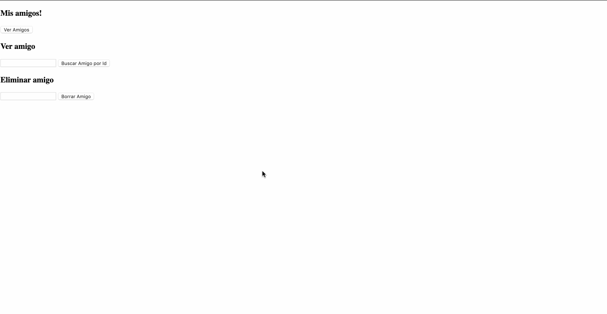

# Ejercicio AJAX

#### Pre-requisitos:
Antes de desarollar nuestro codigo de front-end necesitaremos un servidor al que pedirle los datos de nuestra app usando AJAX. Veremos como escribir estos servidores mas adelante cuando estudiemos backend y NodeJs; mientras tanto utilizaremos un servidor muy simple que tiene las capacidades que necesitamos para el ejercicio.

> Para poder correr el servidor necesitaras tener NodeJs instalado. Puedes descargarlo e instalarlo entrando a la [pagina oficial](https://nodejs.org/en/download/)

Una vez que hayas instalado NodeJs, ve al directorio `04-ajax/homework` desde la terminal y corre estos dos comandos:
```shell
npm install
npm start # Este ultimo comando no nos retornara la terminal, sino que quedara ejecutando. Necesitamos dejarlo abierto mientras trabajamos
```

#### Tareas:
Escribe codigo en los archivos `index.html` y `index.js` para que la pagina tenga las siguientes funcionalidades:

- Utiliza el evento `click` en un boton para hacer que al hacer click en el mismo aparezca en el DOM una lista con todos los amigos que el servidor nos devolvera al hacer un `GET` a la ruta ``http://localhost:5000/amigos


- Un campo de busqueda (input) que reciba el id de un amigo y un boton "buscar". Al hacer click en el boton, buscaremos el amigo que tiene ese id en el servidor, y lo mostraremos en el DOM. Para conseguir los datos de un amigo en particular del servidor, puedes hacer un `GET` nuestro servidor concatenando el `id` del amigo que queremos encontrar, Por ej: `http://localhost:5000/amigos/1` le pediria al servidor el amigo con `id = 1`

- Un input que reciba el id de un amigo y un boton "borrar". Al hacer click en el boton, borraremos el amigo del servidor haciendo un `DELETE` a nuestro servidor, concatenando el id del usuario que queremos borrar. Por ej: `http://localhost:5000/amigos/2` le pediria al servidor el amigo con `id = 2`


# Recordatorio
- Para manipular un elemento de html en con jquery debes usar $('#id-elemento') agregandole como arguemnto el id del elemento que quieres manipular

#### Deberia quedar parecido a esto



